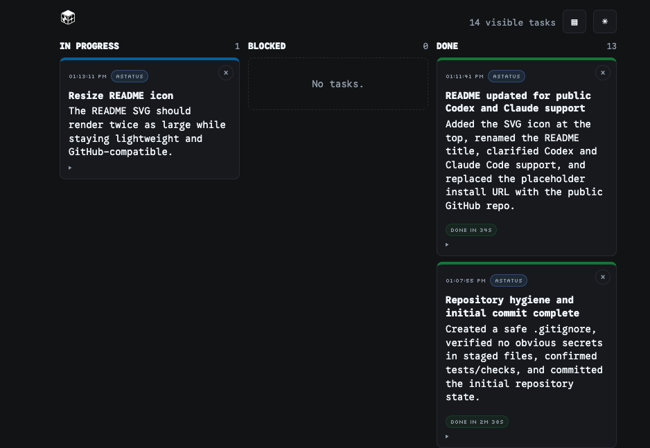

<p align="center">
  
</p>

# Agent Status Board

<p align="center">
  
</p>


If you've got multiple different projects running in different coding harnesses on your computer, this tool is meant to help.
For me, I find that I start off a bunch of projects and threads -- some in Claude, many in Codex -- and I might only remember hours later, "oh yeah, i was doing something over here..." on one of them.  
This project tells each agent "Hey, report in when you do a thing" and shows it on a *read-only* Kanban board that will let you kinda keep track of all the things.

Codex Desktop, Codex CLI and Claude Code will work as their working context includes the reporting rules in
`STATUS_RULES.md`.

## How to Run

One-line install and run:

```bash
curl -fsSL https://raw.githubusercontent.com/sunriseai/agent_status_board/main/scripts/run.sh | sh
```

Then point your browser to http://localhost:5747

That command creates or reuses `~/.agent-status-board/.venv`, installs the
latest public GitHub version and its Python dependencies, then starts
`agent-status-board`. It installs from the GitHub source archive, so it does not
require a local `git` command. It requires Python 3.10 or newer.

You can also clone the repo and run using the Makefile.


## Use With Codex

Start the board first, copy `STATUS_RULES.md` into that repo or reference it by absolute path in your
prompt.  Then ask Codex to follow `STATUS_RULES.md` for the task.
The agent should report task-level actions, not every tool call.

You can grab `STATUS_RULES.md` here:
```text
https://github.com/sunriseai/agent_status_board/blob/main/STATUS_RULES.md
```

Reports can include:

- `repo`: stable short repository or workspace name, such as `astatus`
- `session_id`: stable ID for one Codex working session
- `task_id`: stable slug for related status reports about the same task

Use `repo` when agents from multiple repositories post to the same board. Keep
it short and stable, preferably the repository directory name. Do not use a full
local path. If `repo` is omitted, blank, or `default`, it is not shown in the UI.
The `/events` and `/tasks` endpoints accept an optional `repo` query parameter
for filtering.

### Codex Sandbox Note

Codex may ask for approval the first time it posts to the local status server
because localhost HTTP requests are treated as network access by the shell
sandbox. This works best with Codex Auto-Review enabled, or with a persisted
approval for the scoped local status-report command, such as:

```text
curl -s -X POST http://localhost:5747/report
```

Without Auto-Review or a persisted approval, Codex may ask before each status
`curl`. There is no server-side workaround for this; the request is still local
HTTP network access from the sandbox's perspective. If approval is denied or
unavailable, Codex should state that status reporting failed and continue only
if best-effort reporting is acceptable.

Approval bootstrap limitation: if Codex has not yet been approved to post to the
local status server, it may be unable to report that it is blocked on that same
approval. In that case, the blockage appears in the chat or approval UI rather
than on the board. For reliable `blocked` reporting, enable Auto-Review or
persist approval for the scoped local status-report `curl`.

## Use With Claude Code

Start the board first, then open Claude Code in a project that has status
reporting instructions.

### Set up your repos

To have Claude Code report activity from another project to the same local
board, create a `CLAUDE.md` or add to an existing one:

```markdown
## Status Reporting

Follow the rules in `/path/to/astatus/STATUS_RULES.md` while working in this repo.

Key points:
- Post to `http://localhost:5747/report` before starting any task-sized action
- Use `repo`: `<your-repo-name>`, a stable `session_id` for this session, and a slug `task_id` per task
- Report `in_progress`, `done`, `blocked`, and direction changes, not every tool call
- If the server is unavailable, say so and continue only if the user allows best-effort reporting
```

Replace `/path/to/astatus/STATUS_RULES.md` with the actual path, or copy the
contents of `STATUS_RULES.md` inline. Set `repo` to a short stable name, usually
the repository directory name, so cards from different projects are
distinguishable on the board.

### Global Claude Code Setup

To report from every Claude Code session regardless of project, add the status
reporting rules to your global `~/.claude/CLAUDE.md` instead. Use `repo` in each
report so the board can tell projects apart.


## Additional Runtime Details

To pass CLI options through the one-liner:

```bash
curl -fsSL https://raw.githubusercontent.com/sunriseai/agent_status_board/main/scripts/run.sh | sh -s -- --port 6000
```

For an inspect-first flow:

```bash
curl -fsSLO https://raw.githubusercontent.com/sunriseai/agent_status_board/main/scripts/run.sh
less run.sh
sh run.sh
```

From a checkout, install for local development:

```bash
python3 -m venv .venv
source .venv/bin/activate
python3 -m pip install -e ".[dev]"
```

Requires Python 3.10 or newer. Runtime dependencies are intentionally small:
Flask 3.x for the local server, plus pytest 8.x for development/tests.

Start the server:

```bash
agent-status-board
```

Open:

```text
http://localhost:5747
```

Check readiness:

```bash
curl -s http://localhost:5747/health
```

You can also run from a checkout without installing the console command:

```bash
make dev
```

## Install From Git

Install the public repo directly with pip:

```bash
python3 -m venv .venv
source .venv/bin/activate
python3 -m pip install "git+https://github.com/sunriseai/agent_status_board.git"
agent-status-board
```

For editable contributor installs, use:

```bash
python3 -m pip install -e ".[dev]"
```

Create a default preferences file:

```bash
agent-status-board --init
```

CLI overrides:

```bash
agent-status-board --port 6000
agent-status-board --allow-remote
agent-status-board --prefs ./prefs.txt
agent-status-board --event-log ./data/events.jsonl
agent-status-board --no-persistence
```

## Preferences

Runtime settings live in `prefs.txt`. The file uses simple `key=value` lines.
Blank lines and lines starting with `#` are ignored. Unknown keys are ignored.

```text
refresh_rate_seconds=1
port=5747
allow_remote=false
board_limit=100
stream_limit=50
board_statuses=proposed,in_progress,blocked,done
```

Supported preferences:

| Key | Default | Valid values | Effect |
| --- | --- | --- | --- |
| `refresh_rate_seconds` | `1` | Number from `0.25` to `60` | Browser polling interval for board and stream refreshes. |
| `port` | `5747` | Integer from `1` to `65535` | Flask HTTP port used by `make dev` and `python3 server.py`. |
| `allow_remote` | `false` | `true`/`false`, `yes`/`no`, `on`/`off`, or `1`/`0` | Controls whether the server listens only locally or on all network interfaces. |
| `board_limit` | `100` | Integer from `1` to `200` | Number of task cards requested by the browser for the board. |
| `stream_limit` | `50` | Integer from `1` to `200` | Number of event rows requested by the browser for the stream. |
| `board_statuses` | `proposed,in_progress,blocked,done` | Comma-separated subset of `proposed`, `in_progress`, `blocked`, `done` | Board columns to show, in order. Invalid statuses are ignored. |

Out-of-range numeric values are clamped to the valid range. Invalid values keep
the default.

If `board_statuses` lists fewer than four statuses, the board builds only those
columns and centers them as a narrower grid. The `/tasks` API still returns all
statuses; this preference only changes the browser board view.

Network binding:

- `allow_remote=false` binds Flask to `127.0.0.1`, which is reachable only from the local machine.
- `allow_remote=true` binds Flask to `0.0.0.0`, which allows other machines on your network to connect if firewall and network settings permit it.

Restart the server after changing `prefs.txt`; preferences are read at startup.
Set `AGENT_STATUS_PREFS=/path/to/prefs.txt` to use a different preferences file.
If you change the port or base URL, update `STATUS_RULES.md` so agents keep
posting reports to the correct `/report` endpoint.


## Persistence

Accepted reports are kept in memory and appended to:

```text
data/events.jsonl
```

Hiding an event marks it hidden in memory and appends a small hide tombstone to the
same JSONL file. Hidden events are excluded from the board and event stream after
refresh or restart.

Override the path:

```bash
AGENT_STATUS_EVENT_LOG=/tmp/agent-status/events.jsonl make dev
```

Disable persistence:

```bash
AGENT_STATUS_EVENT_LOG="" make dev
```

## Clear Old Events

Event history is intentionally ephemeral. After handing work off to Git, stop the server and clear persisted events:

```bash
make clear-events
```

Then restart the server. Clearing the JSONL file does not remove events already loaded in a running Flask process.

## Test

```bash
make test
```
